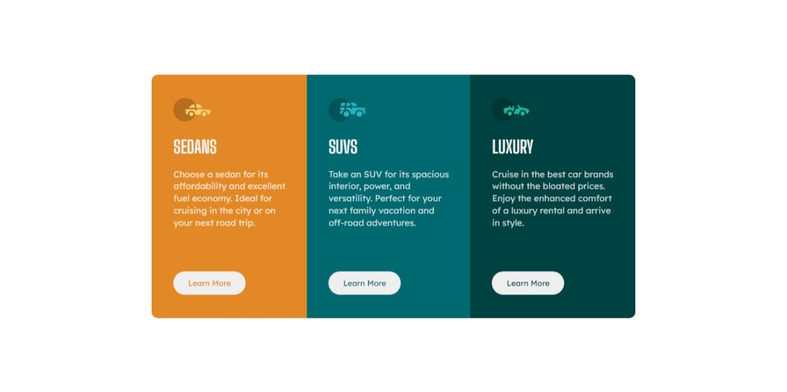

# Frontend Mentor - 3-column preview card component solution

### Links

- Solution URL: [(https://www.frontendmentor.io/solutions/basic-flex-and-grid-SyljOFNr5)]
- Live Site URL: [(https://gabyeager.github.io/Front-End-Mentor-Challenges/Newbie/3-column%20preview%20card%20component)]

This is a solution to the [3-column preview card component challenge on Frontend Mentor](https://www.frontendmentor.io/challenges/3column-preview-card-component-pH92eAR2-). Frontend Mentor challenges help you improve your coding skills by building realistic projects.

### The challenge

Users should be able to:

- View the optimal layout depending on their device's screen size
- See hover states for interactive elements

### Screenshot

