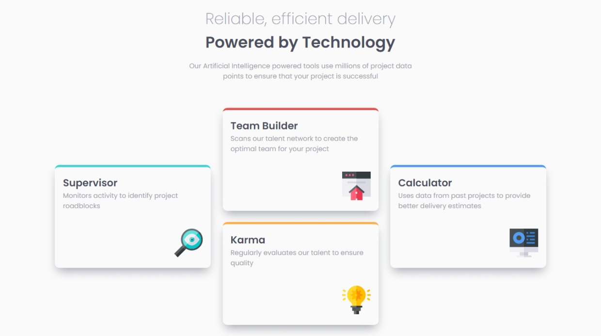

# Frontend Mentor - Four card feature section solution

### Links

- Solution URL: [Here](https://www.frontendmentor.io/solutions/responsive-page-r1UJzy_Lq)
- Live Site URL: [Here](https://gabyeager.github.io/Front-End-Mentor-Challenges/Newbie/Four%20card%20feature%20section/)

This is a solution to the [Four card feature section challenge on Frontend Mentor](https://www.frontendmentor.io/challenges/four-card-feature-section-weK1eFYK). Frontend Mentor challenges help you improve your coding skills by building realistic projects. 

### The challenge

Users should be able to:

- View the optimal layout for the site depending on their device's screen size

### Screenshot

