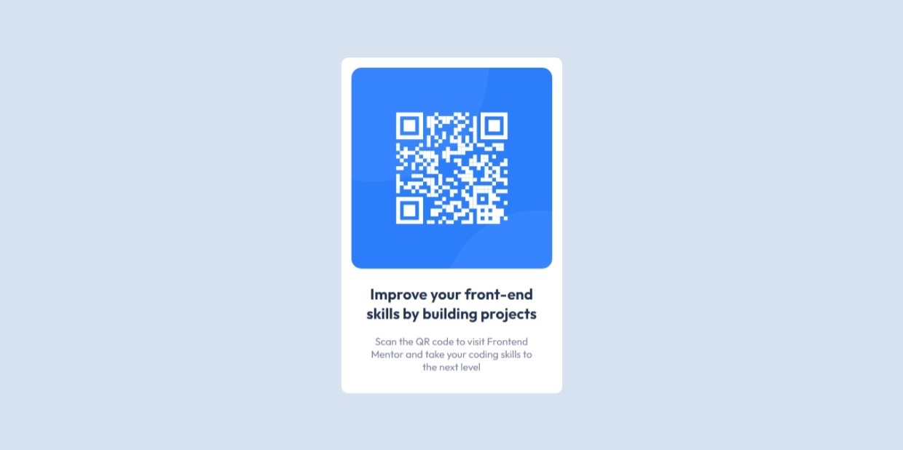

# Frontend Mentor - QR code component solution

### Links

- Solution URL: [Here](https://www.frontendmentor.io/solutions/basic-grid-lVWNgIkfFB)
- Live Site URL: [Here](https://gabyeager.github.io/Front-End-Mentor-Challenges/Newbie/QR%20code%20component/)

This is a solution to the [QR code component challenge on Frontend Mentor](https://www.frontendmentor.io/challenges/qr-code-component-iux_sIO_H). Frontend Mentor challenges help you improve your coding skills by building realistic projects. 

### Screenshot

